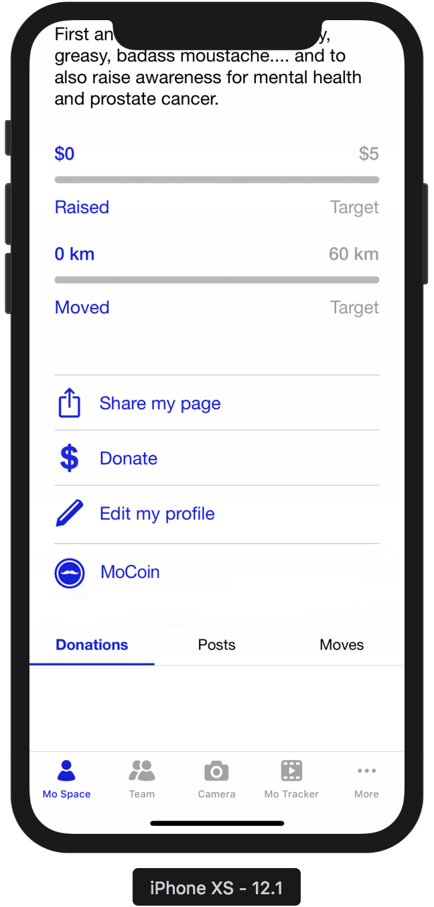
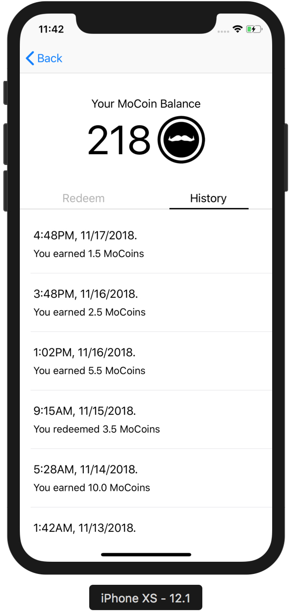

Demo Blockchain Network: See [constantmori/blockchain-loyalty](https://github.com/constantmori/blockchain-loyalty) repository for our Demo Blockchain Network.

Our proposed blockchain loyalty model brings new value to donors and participants, and rewards those who frequently participate and engage with the Foundation. Users of the Movember app would be able to earn points for actions/activities, which can translate into some type of reward such as discounts or freebies with partners.  Members work toward a certain amount of points to redeem their reward, and rewards offered by partners could be added on a time-limited or ad-hoc basis to further encourage activity. We believe this model would be successful at shaping user behaviour to engage with the Foundation beyond the traditional time of peak activity.

We conceptualize that coins could be awarded to users for various activities:
  - Initial app download/install
  - Referring a member to join
  - Opening the Movember app each day consecutively
  - Making a number of posts or updates to a MoSpace
  - Clicking a link in a targeted email campaign
  - Social media engagement: e.g. Retweet or use of a unique hashtag.
  - Reading/consuming promotional or health-related content on Movember.com
  - Attending a Movember themed event or gala
  - Other time-limited contests

